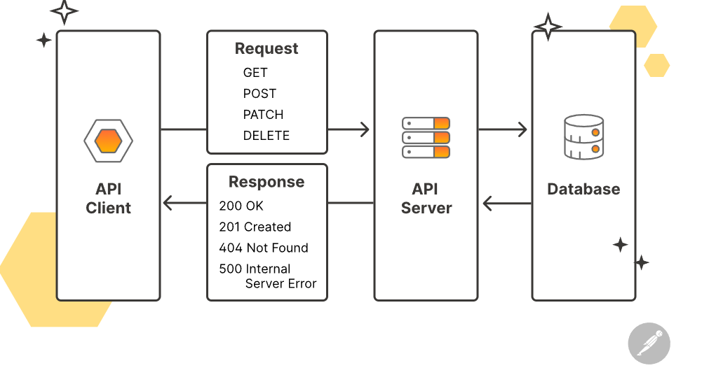
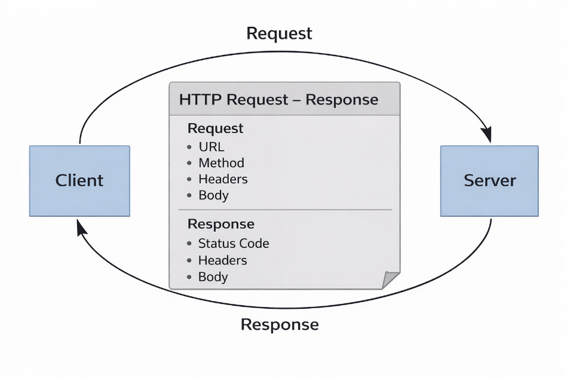
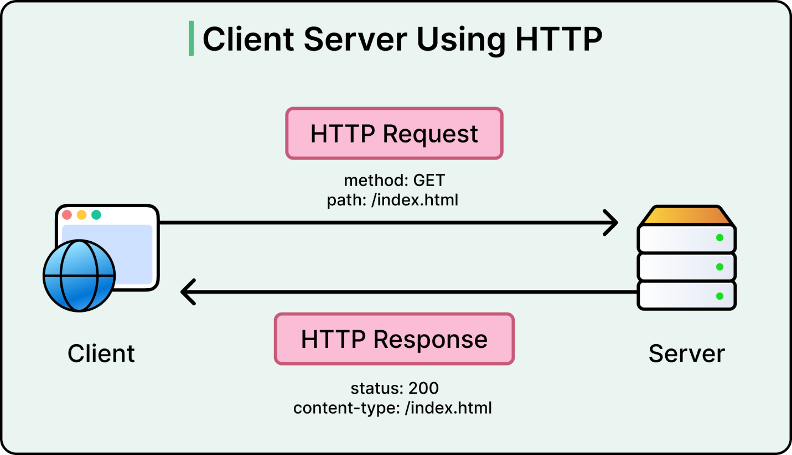

În cadrul acestui laborator vom realiza un proiect de tip **ASP.NET Core Web API**. Deși Web API-urile utilizează *controllers* (componenta Controller din arhitectura MVC), nu vor fi utilizate Views sau Razor Pages.

Accentul este pus exclusiv pe expunerea de endpoint-uri HTTP și pe modelul request-response, nu pe MVC clasic. Vom explora întreaga arhitectură MVC pe parcursul semestrului.

# Obiective laborator

- Înțelegerea modelului request-response
- Introducerea conceptului de Web API
- Înțelegerea principiilor REST
- Familiarizare cu metodele HTTP și status codes
- Implementarea unui API simplu cu date în memorie
- Testarea endpoint-urilor folosind Swagger UI

# Ce este un Web API și de ce îl folosim

Un Web API reprezintă o interfață prin care un server expune date și funcționalități către clienți prin intermediul protocolului HTTP. Clienții pot fi aplicații web, aplicații mobile sau alte servicii backend.

Contractul dintre client și server este definit de:

- metoda HTTP utilizată
- ruta (URL-ul) endpoint-ului
- body-ul cererii (de obicei JSON)
- codul de stare HTTP



Web API-urile permit separarea frontend-ului de backend și integrarea ușoară între sisteme diferite.

# Modelul request-response (HTTP)

**Request**

Un request HTTP este trimis de client către server și conține:

- metoda HTTP (GET, POST, DELETE etc.)
- URL-ul resursei
- headers (ex: Content-Type)
- body (opțional, în format JSON pentru POST)

**Response**

Un response HTTP este trimis de server și conține:

- status code
- headers
- body (de obicei JSON)



# REST și lucrul cu resurse

REST (*Representational State Transfer*) este un stil arhitectural bazat pe lucrul cu resurse identificate prin URL-uri.

Operațiile CRUD sunt mapate pe metode HTTP:

| CRUD   | Metodă HTTP |
|--------|-------------|
| Create | POST        |
| Read   | GET         |
| Update | PUT / PATCH |
| Delete | DELETE      |

# Metode HTTP

| Metodă HTTP | Descriere                      |
|-------------|--------------------------------|
| GET         | Citirea datelor                |
| POST        | Crearea unei resurse           |
| DELETE      | Ștergerea unei resurse         |
| PUT         | Update complet al unei resurse |
| PATCH       | Update parțial al unei resurse |

# HTTP Status Codes

Codurile de stare HTTP indică rezultatul unei cereri. Prima cifră definește categoria: 2xx pentru succes, 3xx pentru redirecționare, 4xx pentru erori ale clientului și 5xx pentru erori ale serverului.

| Cod | Categorie | Semnificație | Metodă (ControllerBase) |
|----|----|----|----|
| 200 | Success | OK - cererea a reușit (GET) | [Ok(object value)](https://learn.microsoft.com/en-us/dotnet/api/microsoft.aspnetcore.mvc.controllerbase.ok) |
| 201 | Success | Created - resursa a fost creată (POST) | [CreatedAtAction(...)](https://learn.microsoft.com/en-us/dotnet/api/microsoft.aspnetcore.mvc.controllerbase.createdataction) |
| 204 | Success | No Content - succes fără body (DELETE) | [NoContent()](https://learn.microsoft.com/en-us/dotnet/api/microsoft.aspnetcore.mvc.controllerbase.nocontent) |
| 301 | Redirection | Moved Permanently - resursa a fost mutată permanent | [RedirectPermanent(string url)](https://learn.microsoft.com/en-us/dotnet/api/microsoft.aspnetcore.mvc.controllerbase.redirectpermanent) |
| 302 | Redirection | Found - redirecționare temporară | [Redirect(string url)](https://learn.microsoft.com/en-us/dotnet/api/microsoft.aspnetcore.mvc.controllerbase.redirect) |
| 304 | Redirection | Not Modified - resursa nu s-a schimbat (cache) | /- |
| 400 | Client Error | Bad Request - cerere invalidă / validare eșuată | [BadRequest(...)](https://learn.microsoft.com/en-us/dotnet/api/microsoft.aspnetcore.mvc.controllerbase.badrequest) |
| 403 | Client Error | Forbidden - acces interzis (autentificat, dar fără permisiuni) | [Forbid()](https://learn.microsoft.com/en-us/dotnet/api/microsoft.aspnetcore.mvc.controllerbase.forbid) |
| 404 | Client Error | Not Found - resursa nu există | [NotFound()](https://learn.microsoft.com/en-us/dotnet/api/microsoft.aspnetcore.mvc.controllerbase.notfound) |
| 500 | Server Error | Internal Server Error - eroare internă a serverului | /- |

Pentru o prezentare completă *HTTP methods* și *status codes*, consultați referințele de la finalul laboratorului, precum și documentul [RFC2616: **Hypertext Transfer Protocol -- HTTP/1.1**](https://datatracker.ietf.org/doc/html/rfc2616).



# Demo laborator: Students API

Clasa Student conține proprietățile: Id, Name, Average, Specialization (enum). Datele sunt stocate într-o listă în memorie, simulând un layer de persistență.

Această listă poate fi privită ca o abstractizare a unei surse reale de date, precum o bază de date, un fișier (XML, JSON, CSV), un serviciu extern sau orice altă sursă care poate fi expusă sub forma unei colecții ce implementează IEnumerable.

```csharp
public enum Specialization
{
    Mathematics,
    ComputerScience,
    Physics
}
public class Student
{
    public int Id { get; set; }
    public string Name { get; set; } = string.Empty;
    public double Average { get; set; }
    public Specialization Specialization { get; set; }
}
```

#  Controllere și rute

Un controller Web API definește un set de endpoint-uri asociate unei resurse. Atributul [ApiController] activează comportamente specifice Web API (validare automată, binding din body etc.), iar [Route("api/[controller]")] definește ruta de bază, în acest caz /api/students.

Exemplu de rută:

- /api/students - colecția de studenți
- /api/students/{id} - un student specific

Rutele sunt mapate pe metode HTTP folosind atributele [HttpGet], [HttpPost], [HttpDelete].

Parametrii pot fi definiți fie în rută (*route parameters*), fie în *query string*.

Un parametru de rută este inclus direct în URL, de exemplu /api/students/3, unde 3 este valoarea pentru {id}. În acest caz, valoarea este extrasă automat din rută (*route parameter*) și poate fi marcată explicit cu atributul [FromRoute].

Parametrii din query string apar după ?, de exemplu /api/students/filter?minAverage=8, și sunt utilizați pentru filtrare sau modificarea rezultatului. Aceștia sunt mapați automat din query string și pot fi marcați explicit cu [FromQuery].

În aplicațiile Web API moderne se folosește preponderent *attribute routing* (definirea rutelor prin atribute precum [Route], [HttpGet] etc.). *Conventional routing*, definit în Program.cs, este utilizat mai frecvent în aplicațiile MVC clasice și mapează rutele pe baza unor convenții implicite.

```csharp
[ApiController]
[Route("api[controller]")]
public class StudentsController : ControllerBase
{
    private static readonly List<Student> students = new()
    {
        new Student { Id = 1, Name = "Ana", Average = 9.10, Specialization = Specialization.ComputerScience },
        new Student { Id = 2, Name = "Mihai", Average = 7.50, Specialization = Specialization.Mathematics },
        new Student { Id = 3, Name = "Ioana", Average = 8.30, Specialization = Specialization.Physics },
        new Student { Id = 4, Name = "Andrei", Average = 6.90, Specialization = Specialization.ComputerScience },
        new Student { Id = 5, Name = "Maria", Average = 9.60, Specialization = Specialization.Mathematics },
        new Student { Id = 6, Name = "Alex", Average = 4.7, Specialization = Specialization.Physics }
    };
    // endpoints are defined below
}
```

# Implementare Endpoint-uri

## GET /api/students - toate resursele

Returnează lista completă de studenți cu status 200 OK. Body-ul este serializat automat în JSON.

```csharp
[HttpGet]
public IActionResult GetAll()
{
    return Ok(students);
}
```

## GET /api/students/{id} - filtrare după id

Returnează un student specific. Demonstrează utilizarea status codes-urilor 400 (cerere invalidă), 404 (resursa nu există) și 200 (succes).

```csharp
[HttpGet("{id}")]
public IActionResult GetById(int id)
{
    if (id <= 0)
    {
        return BadRequest("Id must be positive.");
    }

    Student? found = null;
    foreach (var s in students)
    {
        if (s.Id == id)
        {
            found = s;
            break;
        }
    }

    if (found == null)
    {
        return NotFound();
    }

    return Ok(found);
}
```

## POST /api/students - creare resursă

Primește un obiect JSON care este deserializat automat într-un obiect C# Student. Se aplică validări pe Name (minim 3 caractere) și Average (între 1 și 10). Returnează 400 la validare eșuată sau 201 Created la succes. Metoda CreatedAtAction() include în response header-ul Location cu URL-ul noii resurse.

```csharp
[HttpPost]
public IActionResult Create(Student student)
{
    if (student == null)
    {
        return BadRequest("Missing body.");
    }

    if (string.IsNullOrWhiteSpace(student.Name) || student.Name.Trim().Length < 3)
    {
        return BadRequest("Name must be at least 3 characters long.");
    }

    if (student.Average < 1 || student.Average > 10)
    {
        return BadRequest("Average must be between 1 and 10.");
    }

    int newId = 1;
    foreach (var s in students)
    {
        if (s.Id >= newId)
        {
            newId = s.Id + 1;
        }
    }

    student.Id = newId;
    student.Name = student.Name.Trim();
    students.Add(student);
    return CreatedAtAction(nameof(GetById), new { id = student.Id }, student);
}
```

## DELETE /api/students/{id} - ștergere resursă

Returnează 400 pentru id invalid, 404 dacă studentul nu există, sau 204 No Content dacă ștergerea reușește.

```csharp
[HttpDelete("{id}")]
public IActionResult Delete(int id)
{
    if (id <= 0)
    {
        return BadRequest("Id must be positive.");
    }

    int index = -1;
    for (int i = 0; i < students.Count; i++)
    {
        if (students[i].Id == id)
        {
            index = i;
            break;
        }
    }

    if (index == -1)
    {
        return NotFound();
    }

    students.RemoveAt(index);
    return NoContent();
}
```

Exercițiile care urmează au ca scop consolidarea lucrului cu endpoint-uri Web API, metode HTTP și coduri de stare, prin implementarea unor operații de citire, creare, ștergere și interogare a datelor.

Logica de procesare este realizată folosind structuri clasice de control, urmând ca în laboratorul următor aceleași cerințe să fie refactorizate folosind LINQ, iar validarea input-ului să fie realizată prin *DataAnnotations*, păstrând structura endpoint-urilor.

# Exerciții

Pentru fiecare exercițiu: implementați endpoint-ul cerut și verificați comportamentul folosind *Swagger UI*, urmărind status code-ul și body-ul răspunsului.

1.  **(1p)** Implementați endpoint-ul GET /api/students/{id}

    1.  returnați 400 Bad Request dacă Id <= 0

    2.  returnați 404 Not Found dacă nu există niciun student cu acel id

    3.  returnați 200 OK și obiectul Student dacă acesta există

2.  **(1p)** Implementați endpoint-ul POST /api/students

    1.  validați datele primite (nume minim 3 caractere, media între 1 și 10)

    2.  returnați 400 Bad Request în caz de date invalide

    3.  returnați 201 Created și studentul creat în caz de succes

3.  **(1p)** Implementați endpoint-ul DELETE /api/students/{id}

    1.  returnați 400 Bad Request dacă Id <= 0

    2.  returnați 404 Not Found dacă studentul nu există

    3.  returnați 204 No Content dacă ștergerea a fost realizată cu succes

4.  **(2p)** Implementați endpoint-ul POST /api/students/update

    Endpoint-ul primește în body un obiect de tip Student care conține un Id existent, și efectuează următoarele:

    1.  returnează 400 Bad Request dacă Id este invalid

    2.  returnează 404 Not Found dacă studentul cu acel Id nu există

    3.  dacă studentul există, actualizați valorile Name, Average și Specialization și returnați 200 OK cu studentul actualizat

    > Notă: acest exercițiu nu urmărește diferențierea dintre PUT și PATCH, ci doar înțelegerea modificării unei resurse prin API.

5.  **(2p)** Implementați endpoint-ul GET /api/students/filter?minAverage=8

    1.  returnați 400 Bad Request dacă parametrul minAverage lipsește sau este în afara intervalului [1, 10]

    2.  returnați 200 OK și lista studenților care au Average >= minAverage

6.  **(2p)** Implementați endpoint-ul GET /api/students/top?minAverage=8

    1.  validați parametrul minAverage

    2.  returnați studenții cu Average >= minAverage, ordonați descrescător după Average

    3.  returnați 200 OK și lista rezultată

7.  **(2p)** Implementați endpoint-ul GET /api/students/stats

    Endpoint-ul trebuie să returneze un obiect JSON cu următoarele câmpuri:

    - anyComputerScience - există cel puțin un student cu specializarea *ComputerScience*
    - allPassing - toți studenții au Average >= 5

    > Endpoint-ul va returna 200 OK.

## Notă despre persistența datelor

În acest laborator folosim o listă în memorie ca *mock* pentru un layer de persistență. Asta înseamnă că modificările făcute prin endpoint-uri (POST/UPDATE/DELETE) există doar cât timp aplicația rulează.

La repornirea aplicației, lista se reconstruiește din cod și revine la valorile inițiale.

Într-o aplicație reală, layer-ul de persistență ar fi implementat printr-o bază de date / fișier / serviciu extern (de ex. printr-un repository/service), pe care îl vom introduce ulterior.

# IActionResult și tipurile de răspuns HTTP

**Sursă: Microsoft Learn - ASP.NET Core Web API**

“The IActionResult return type is appropriate when multiple ActionResult return types are possible in an action.

The ActionResult types represent various HTTP status codes. Any non-abstract class deriving from ActionResult qualifies as a valid return type.

Some common return types in this category are BadRequestResult (400), NotFoundResult (404), and OkObjectResult (200).

Alternatively, convenience methods in the ControllerBase class can be used to return ActionResult types from an action. For example, return BadRequest(); is a shorthand form of return new BadRequestResult();.” — Microsoft Docs

# Referințe

**Microsoft:**

- [ASP.NET Core Web API - Overview](https://learn.microsoft.com/en-us/aspnet/core/web-api/)
- [Controllers in ASP.NET Core Web API](https://learn.microsoft.com/en-us/aspnet/core/web-api/#controllerbase-class)
- [Routing in ASP.NET Core](https://learn.microsoft.com/en-us/aspnet/core/fundamentals/routing)
- [HTTP request and response overview](https://learn.microsoft.com/en-us/aspnet/core/fundamentals/http-requests)
- [HTTP status codes (Microsoft Docs)](https://learn.microsoft.com/en-us/dotnet/api/system.net.httpstatuscode)

**GeeksforGeeks:**

- [HTTP Methods - GET, POST, PUT, DELETE](https://www.geeksforgeeks.org/http-request-methods/)
- [HTTP Status Codes Explained](https://www.geeksforgeeks.org/http-status-codes/)
- [REST API Introduction](https://www.geeksforgeeks.org/rest-api-introduction/)

**YouTube:**

- [Intro to Web API in .NET 6 - Including Minimal APIs, Swagger, and more](https://www.youtube.com/watch?v=87oOF9Ve-KA)
