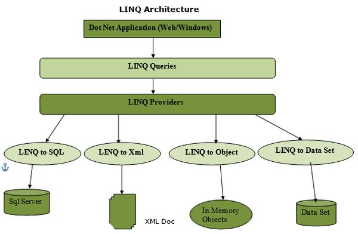
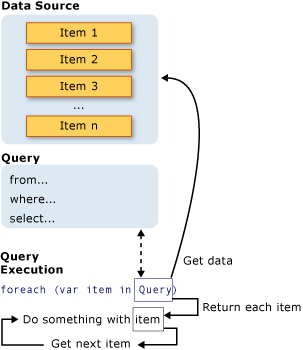
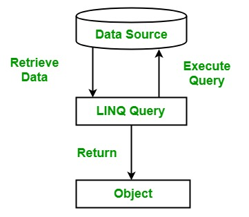

*Referință oficială laborator – <https://learn.microsoft.com/en-us/dotnet/csharp/linq>*

Un *query* reprezintă o expresie care permite preluarea datelor dintr-o sursa de date. Diverse surse de date utilizează limbaje native diferite pentru interograre, spre exemplu SQL pentru bazele de date relaționale și XQuery pentru XML.

În absența unui standard comun, un dezvoltator de aplicații ar fi nevoit să învețe câte un limbaj de interogare diferit pentru fiecare tip de sursă de date sau format de date pe care trebuie să îl suporte.

**LINQ** (*Language Integrated Query*) este un set de metode din .NET care permit interogarea colecțiilor de date folosind o sintaxă unificată în C#.

În acest laborator folosim **LINQ Method Syntax**, bazată pe metode de extensie aplicate colecțiilor care implementează IEnumerable<T>.

Aceste metode permit filtrarea, transformarea și agregarea datelor într-o manieră declarativă.



# Obiective laborator

- Înțelegerea conceptului LINQ și a rolului său în lucrul cu colecții (IEnumerable)
- Utilizarea expresiilor lambda și a **method syntax** (Where, FirstOrDefault, Any, All, OrderByDescending)
- Refactorizarea endpoint-urilor din Lab 2 folosind LINQ și adăugarea de endpoint-uri noi
- Validare input folosind **DataAnnotations** ([Required], [MinLength], [Range], etc.)
- Înțelegerea efectului [ApiController] asupra validării automate
- Înțelegerea comportamentului de **deferred execution**, yield, și coroutines.

# Cele trei părți ale unei operații de tip query

Toate operațiile LINQ sunt alcătute din trei acțiuni distincte:

1.  Obținerea sursei de date

2.  Crearea query-ului

3.  Executarea query-ului

Următorul exemplu ilustrează cum cele trei părți ale unei operații de tip query sunt implementate în cod sursă. Exemplul utilizează un array de numere întregi pentru sursa datelor, pentru conveniență; însa, aceleași concepte se aplică și pentru alte surse de date.

```csharp
// The Three Parts of a LINQ Query:
// 1. Data source.
int[] numbers = [0, 1, 2, 3, 4, 5, 6];
// 2. Query creation.
// numQuery is an IEnumerable<int>
var numQuery = from num in numbers
    where (num % 2) == 0
    select num;
// 3. Query execution.
foreach (int num in numQuery)
{
    Console.WriteLine(num);
}
```



În imaginea de mai sus este ilustrat fluxul complet al unei operații de tip query. În LINQ, execuția query-ului este separată de definirea acestuia. Cu alte cuvinte, datele nu sunt preluate imediat în momentul creării unei variabile de tip query.

# Sursa datelor

În exemplul anterior, sursa datelor este un *array*, care implementează interfața generica [IEnumerable<T>](https://learn.microsoft.com/en-us/dotnet/api/system.collections.generic.ienumerable-1). Acest lucru permite interogarea datelor cu ajutorul LINQ.

Query-ul este executat într-o instrucțiune foreach, care enumeră rezultatele interogării. Tipul de date asupra căruia se aplică interogarea trebuie sa implementeze interfața IEnumerarable<T>.

Prin intermediul [**EntityFramework**](https://learn.microsoft.com/en-us/ef/core/), se poate realiza o mapare între obiecte C# și baze de date relaționale, în care clasele C# reprezintă entități de date care corespund tabelelor din baza de date. Aceasta abordare se numește **ORM** (**Object-Relational Mapping**).

# LINQ Method Syntax

În continuare, nu vom utiliza sintaxa de tip *query expression* (from, where, select). În schimb, vom lucra exclusiv cu *LINQ method syntax*, folosind funcțiile deja existente puse la dispoziție de framework-ul .NET.

Această abordare se bazează pe *extension methods* definite pentru interfețele IEnumerable<T> și IQueryable<T>, care permit filtrarea, proiecția, sortarea și agregarea colecțiilor direct prin apeluri de funcții C#.

În cadrul acestui laborator, exemplele utilizează interfețe de tip IEnumerable<T>, ceea ce presupune evaluarea interogărilor în memorie. Interfața IQueryable<T> va fi discutată ulterior, în contextul interogărilor către baze de date.



# Funcții LINQ utilizate frecvent

| Funcție LINQ | Descriere |
|----|----|
| [Where()](https://learn.microsoft.com/en-us/dotnet/api/system.linq.enumerable.where) | Filtrează elementele unei colecții pe baza unei condiții |
| [Select()](https://learn.microsoft.com/en-us/dotnet/api/system.linq.enumerable.select) | Proiectează fiecare element într-o nouă formă |
| [Distinct()](https://learn.microsoft.com/en-us/dotnet/api/system.linq.enumerable.distinct) | Elimină elementele duplicate |
| [GroupBy()](https://learn.microsoft.com/en-us/dotnet/api/system.linq.enumerable.groupby) | Grupează elementele după o cheie |
| [OrderBy()](https://learn.microsoft.com/en-us/dotnet/api/system.linq.enumerable.orderby) | Sortează elementele în ordine crescătoare |
| [OrderByDescending()](https://learn.microsoft.com/en-us/dotnet/api/system.linq.enumerable.orderbydescending) | Sortează elementele în ordine descrescătoare |
| [ThenBy()](https://learn.microsoft.com/en-us/dotnet/api/system.linq.enumerable.thenby) | Aplică o sortare secundară |
| [First()](https://learn.microsoft.com/en-us/dotnet/api/system.linq.enumerable.first) | Returnează primul element care îndeplinește o condiție |
| [FirstOrDefault()](https://learn.microsoft.com/en-us/dotnet/api/system.linq.enumerable.firstordefault) | Returnează primul element sau valoarea implicită |
| [Single()](https://learn.microsoft.com/en-us/dotnet/api/system.linq.enumerable.single) | Returnează un singur element (eroare dacă sunt mai multe) |
| [Any()](https://learn.microsoft.com/en-us/dotnet/api/system.linq.enumerable.any) | Verifică dacă există cel puțin un element |
| [All()](https://learn.microsoft.com/en-us/dotnet/api/system.linq.enumerable.all) | Verifică dacă toate elementele respectă condiția |
| [Count()](https://learn.microsoft.com/en-us/dotnet/api/system.linq.enumerable.count) | Returnează numărul de elemente |
| [Sum()](https://learn.microsoft.com/en-us/dotnet/api/system.linq.enumerable.sum) | Calculează suma elementelor |
| [Average()](https://learn.microsoft.com/en-us/dotnet/api/system.linq.enumerable.average) | Calculează media elementelor |
| [Min()](https://learn.microsoft.com/en-us/dotnet/api/system.linq.enumerable.min) | Determină valoarea minimă |
| [Max()](https://learn.microsoft.com/en-us/dotnet/api/system.linq.enumerable.max) | Determină valoarea maximă |
| [Take()](https://learn.microsoft.com/en-us/dotnet/api/system.linq.enumerable.take) | Selectează primele n elemente |
| [Skip()](https://learn.microsoft.com/en-us/dotnet/api/system.linq.enumerable.skip) | Sare peste primele n elemente |

Pentru o documentație completă a funcțiilor LINQ disponibile în .NET, consultați pagina oficială Microsoft pentru clasa [System.Linq.Enumerable](https://learn.microsoft.com/en-us/dotnet/api/system.linq.enumerable?view=net-10.0), care listează toate metodele de extensie LINQ cu descrieri și exemple, precum și [tabelul](https://learn.microsoft.com/en-us/dotnet/csharp/linq/get-started/introduction-to-linq-queries#:~:text=the%20resulting%20elements.-,Classification%20table,-The%20following%20table) cu clasificarea query-urilor LINQ.

Metodele LINQ precum Where, Select, Any sau All primesc ca parametru una sau mai multe **lambda expressions (delegates)**. O expresie lambda definește logica aplicată fiecărui element din colecție și returnează, în funcție de metodă, o valoare booleană (pentru filtrare) sau o valoare proiectată.

De exemplu, în cazul metodei Where, expresia lambda returnează true pentru elementele care trebuie păstrate în rezultat și false pentru cele care sunt eliminate.

Metoda Select() este utilizată pentru a transforma fiecare element al unei colecții într-o nouă formă.

Pentru fiecare element din sursa de date, expresia lambda este evaluată, iar rezultatul este inclus în colecția finală. Tipul elementelor din colecția rezultată poate fi diferit față de tipul elementelor din colecția inițială.

```csharp
string[] words = ["the", "quick", "brown", "fox", "jumps"];
IEnumerable<string> query =
    words.Where(word => word.Length == 3);
foreach (string str in query)
{
    Console.WriteLine(str);
}
/* This code produces the following output:
the
fox
*/
```

În exemplele de mai sus, interogările LINQ nu sunt executate în momentul definirii lor, ci doar atunci când rezultatul este enumerat (de exemplu prin foreach, ToList(), ToArray() etc.).

Acest comportament se numește **deferred execution**.

Majoritatea metodelor LINQ care operează pe IEnumerable<T> sunt **lazy**: ele descriu doar operația care trebuie efectuată, fără a calcula imediat rezultatul. Evaluarea are loc abia atunci când colecția rezultată este parcursă.

Există însă și metode care materializează rezultatul, cum ar fi ToList() sau ToArray(). Acestea forțează executarea interogării și creează o colecție nouă în memorie.

Pentru detalii și explicații despre modul în care LINQ realizează această execuție întârziată, consultați documentația oficială Microsoft pe tema [Deferred execution and lazy evaluation](https://learn.microsoft.com/en-us/dotnet/standard/linq/deferred-execution-lazy-evaluation) din LINQ, precum și [playlist-ul lui Jamie King despre LINQ](https://www.youtube.com/playlist?list=PL90AF0EFFEF782D27), pentru aprofundare.

În laboratorul următor, același principiu va apărea și în contextul bazelor de date: interogările LINQ definite asupra unui DbSet sunt executate doar atunci când sunt materializate, moment în care sunt traduse în SQL și trimise către baza de date.

# Iteratori și yield return

În C#, un iterator este o metodă care produce secvențial elemente ale unei colecții folosind cuvântul cheie yield return.

Metodele care folosesc yield return întorc de obicei un IEnumerable<T> și generează elementele la momentul enumerării, nu la momentul apelului metodei.

Acest comportament este similar cu *deferred execution* din LINQ: rezultatele sunt calculate doar atunci când colecția este parcursă.

```csharp
public static IEnumerable<Student> FilterByAverageYield(
    IEnumerable<Student> students,
    double minAverage)
{
    foreach (Student s in students)
    {
        if (s.Average >= minAverage)
        {
            yield return s;
        }
    }
}
```

Metoda nu creează o listă nouă, ci produce elementele pe rând atunci când rezultatul este enumerat.

Exemplu de utilizare:

```csharp
var query = FilterByAverageYield(students, 8)
.OrderByDescending(s => s.Average);
var result = query.ToList();
```

Rezultatul este calculat doar în momentul apelului ToList().

# Validare cu Data Annotations

**Data Annotations** sunt atribute aplicate pe proprietățile unei clase pentru a defini reguli de validare asupra datelor. Aceste reguli descriu ce valori sunt considerate valide pentru un model sau un DTO.

Prin utilizarea Data Annotations, regulile de validare sunt declarate direct în model, ceea ce face codul mai clar și mai ușor de întreținut. Framework-ul .NET poate folosi aceste atribute pentru a valida automat datele primite din diferite surse (de exemplu formulare, request-uri HTTP sau alte mecanisme de binding).

Conceptual, Data Annotations pot fi privite ca echivalentul, la nivelul aplicației, al unor constrângeri din baza de date, precum NOT NULL sau CHECK.

**  **

| Atribut | Rol | Analogie SQL |
|----|----|----|
| [Required](https://learn.microsoft.com/en-us/dotnet/api/system.componentmodel.dataannotations.requiredattribute) | Câmp obligatoriu | NOT NULL |
| [StringLength](https://learn.microsoft.com/en-us/dotnet/api/system.componentmodel.dataannotations.stringlengthattribute) | Limitează lungimea unui string | VARCHAR(n) |
| [MinLength](https://learn.microsoft.com/en-us/dotnet/api/system.componentmodel.dataannotations.minlengthattribute) | Lungime minimă pentru string sau colecții | CHECK |
| [MaxLength](https://learn.microsoft.com/en-us/dotnet/api/system.componentmodel.dataannotations.maxlengthattribute) | Lungime maximă pentru string sau colecții | VARCHAR(n) |
| [Range](https://learn.microsoft.com/en-us/dotnet/api/system.componentmodel.dataannotations.rangeattribute) | Restricționează valorile numerice la un interval | CHECK BETWEEN |
| [EmailAddress](https://learn.microsoft.com/en-us/dotnet/api/system.componentmodel.dataannotations.emailaddressattribute) | Verifică formatul unui email | validare aplicație |
| [RegularExpression](https://learn.microsoft.com/en-us/dotnet/api/system.componentmodel.dataannotations.regularexpressionattribute) | Validează valoarea folosind regex | CHECK personalizat |
| [Compare](https://learn.microsoft.com/en-us/dotnet/api/system.componentmodel.dataannotations.compareattribute) | Compară două proprietăți | /- |

# Exemplu

```csharp
public class CreateStudentRequest
{
    [Required]
    [MinLength(3)]
    public string Name { get; set; } = string.Empty;

    [Range(1, 10)]
    public double Average { get; set; }

    [Required]
    public Specialization Specialization { get; set; }
}
```

În acest exemplu:

- Name este obligatoriu și trebuie să aibă minimum 3 caractere;
- Average trebuie să fie între 1 și 10;
- Specialization este obligatorie

Pentru exemple complete de utilizare a Data Annotations în ASP.NET, consultați:  
<https://learn.microsoft.com/en-us/aspnet/core/mvc/models/validation>

# Exerciții

În acest laborator păstrăm aceeași structură de controller din laboratorul anterior, dar mutăm accentul de pe mecanica endpoint-urilor pe două idei noi: exprimarea logicii de procesare prin LINQ și validarea modelelor prin Data Annotations.

Acum, logica de procesare se implementează folosind *LINQ* (înlocuind structurile clasice for/foreach), iar validarea input-ului primit în body se realizează prin DataAnnotations ([Required], [MinLength], [Range] etc.), fără validări manuale pe câmpuri.

Datorită atributului [ApiController], în cazul unui model invalid, framework-ul returnează automat 400 Bad Request, fără verificări explicite ModelState.IsValid. Pentru parametri din rută și query string, validarea se face manual.

Pentru fiecare exercițiu: modificați / implementați endpoint-ul cerut și verificați comportamentul folosind *Swagger UI*, urmărind status code-ul și body-ul răspunsului.

1.  **(1p)** Modificați endpoint-ul GET /api/students/{id}

    1.  validați parametrul Id (Id > 0)

    2.  returnați 404 Not Found dacă nu există niciun student cu acel id

    3.  returnați 200 OK și obiectul Student dacă acesta există

> Indicații: căutarea studentului se face folosind FirstOrDefault(…)

2.  **(2p)** Modificați endpoint-ul POST /api/students

    1.  definiți un DTO CreateStudentRequest folosind DataAnnotations și validați datele primite (nume minim 3 caractere, media între 1 și 10, specializare Required)

    2.  la succes, creați studentul, setați un Id nou, și returnați 201 Created și studentul creat

> Indicații: nu folosiți if pentru validarea câmpurilor din body.

3.  **(1p)** Modificați endpoint-ul DELETE /api/students/{id}

    1.  validați parametrul Id (Id > 0)

    2.  returnați 404 Not Found dacă studentul nu există

    3.  returnați 204 No Content dacă ștergerea a fost realizată cu succes

> Indicații: găsirea studentului se face cu FirstOrDefault(…)

4.  **(1p)** Modificați endpoint-ul POST /api/students/update

    Endpoint-ul primește în body un obiect de tip Student care conține un Id existent, și efectuează următoarele:

    1.  validează parametrul Id (Id > 0)

    2.  returnează 404 Not Found dacă studentul cu acel Id nu există

    3.  dacă studentul există, actualizați valorile Name, Average și Specialization și returnați 200 OK cu studentul actualizat

    > Notă: acest exercițiu nu urmărește diferențierea dintre PUT și PATCH, ci doar înțelegerea modificării unei resurse prin API.

5.  **(1p)** Modificați endpoint-ul GET /api/students/filter?minAverage=8

    1.  validați parametrul minAverage (trebuie să existe și să fie în intervalul [1, 10])

    2.  returnați 200 OK și lista studenților care au Average >= minAverage

> Indicații: Filtrarea se face cu Where(…) + ToList().

6.  **(1p)** Modificați endpoint-ul GET /api/students/top?minAverage=8

    1.  validați parametrul minAverage

    2.  selectați studenții cu Average >= minAverage, ordonați rezultatul descrescător după Average și returnați 200 OK împreună cu lista rezultată

7.  **(1p)** Modificați endpoint-ul GET /api/students/stats

    Endpoint-ul trebuie să returneze un obiect JSON cu următoarele câmpuri:

    - anyComputerScience - există cel puțin un student cu specializarea ComputerScience
    - allPassing - toți studenții au Average >= 5

    > Endpoint-ul va returna 200 OK.
    >
    > Indicații: folosiți Any(…) și All(…).

8.  **(2p)** Implementați endpoint-ul GET /api/students/specializations

    Endpoint-ul va returna lista specializărilor existente în colecția de studenți.

    1.  fiecare specializare trebuie să apară o singură dată

    2.  rezultatul trebuie ordonat alfabetic

    3.  returnați 200 OK și lista rezultată

    > Indicații: folosiți Select(…), Distinct(…) și OrderBy(…).

9.  **(2p)** Implementați endpoint-ul GET /api/students/stats-by-specialization

    Endpoint-ul va returna statistici pentru fiecare specializare.

    Pentru fiecare specializare returnați:

    - numărul de studenți (count)
    - media mediilor (average)
    - media minimă (min)
    - media maximă (max)

    Returnați rezultatul sub forma unei liste de obiecte JSON.

    > Indicații: folosiți GroupBy(…) și metodele de agregare Count(), Average(), Min(), Max().

10. **(2p)** Implementați endpoint-ul GET /api/students/search?text=an&minAverage=7

    Endpoint-ul va returna studenții care îndeplinesc următoarele condiții:

    1.  numele studentului conține textul transmis prin parametrul text

    2.  dacă parametrul minAverage este prezent, se vor returna doar studenții cu Average >= minAverage

    Rezultatul trebuie:

    - sortat descrescător după Average
    - sortat crescător după Name (sortare secundară)

    Returnați 200 OK și lista rezultată.

    > Indicații: folosiți Where(…), OrderByDescending(…), ThenBy(…) și Select(…).

11. **(2p)** Implementați endpoint-ul GET /api/students/page?page=1&pageSize=3

    Endpoint-ul va returna studenții în mod paginat.

    1.  validați parametrii page și pageSize

    2.  calculați elementele care trebuie returnate pentru pagina cerută

    3.  returnați 200 OK și lista studenților din pagina respectivă

    > Indicații: folosiți Skip(…) și Take(…).

12. **(2p)** Extindeți endpoint-ul existent GET /api/students/stats astfel încât să returneze și următoarele informații:

    - numărul total de studenți
    - media generală a mediilor
    - media maximă
    - media minimă

    Returnați rezultatul sub forma unui obiect JSON.

    > Indicații: folosiți Count(), Average(), Max() și Min().

13. **(2p)** Implementați endpoint-ul GET /api/students/top-specialization

    Endpoint-ul va returna specializarea care are cea mai mare medie a mediilor studenților.

    1.  grupați studenții după Specialization

    2.  calculați media mediilor pentru fiecare specializare

    3.  selectați specializarea care are valoarea maximă

    4.  returnați 200 OK și rezultatul obținut

    > Indicații: folosiți GroupBy(…), Select(…), OrderByDescending(…) și First().

14. **(2p)** Implementați o metodă helper care returnează studenții cu media mai mare sau egală cu o valoare dată.

    Metoda trebuie să folosească yield return și să întoarcă IEnumerable<Student>.

    1.  definiți un query LINQ peste rezultatul metodei

    2.  modificați lista students după definirea query-ului

    3.  materializați rezultatul folosind ToList() și observați rezultatul

    Explicați diferența dintre deferred execution și materializarea rezultatelor. Ce avantaje avem folosind deferred execution?
